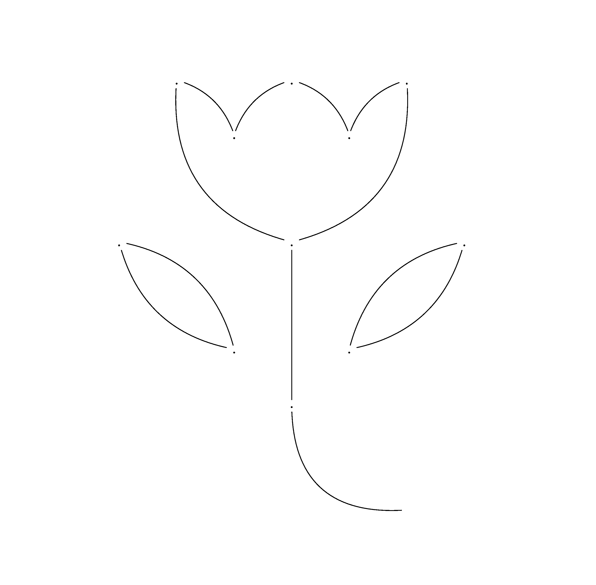
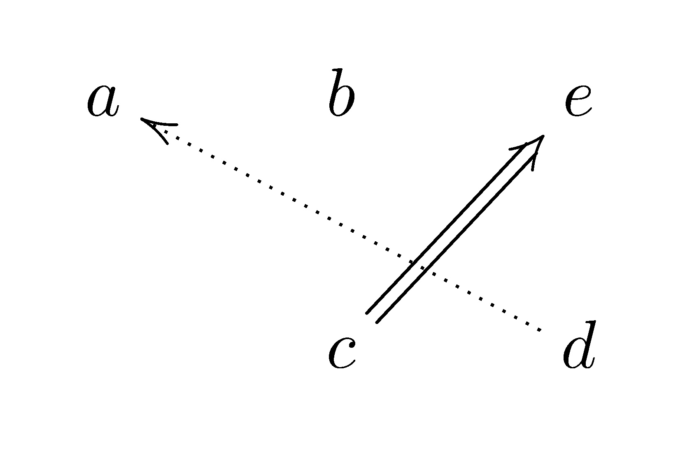
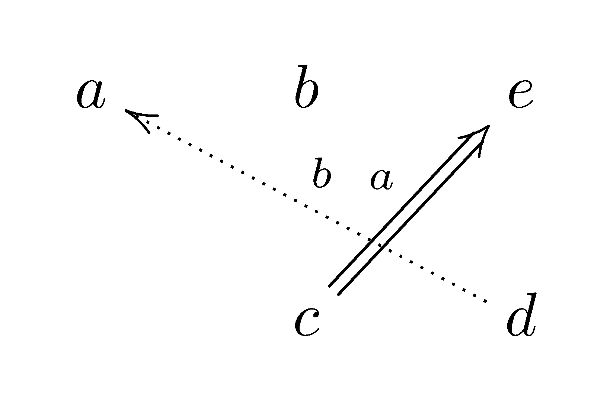
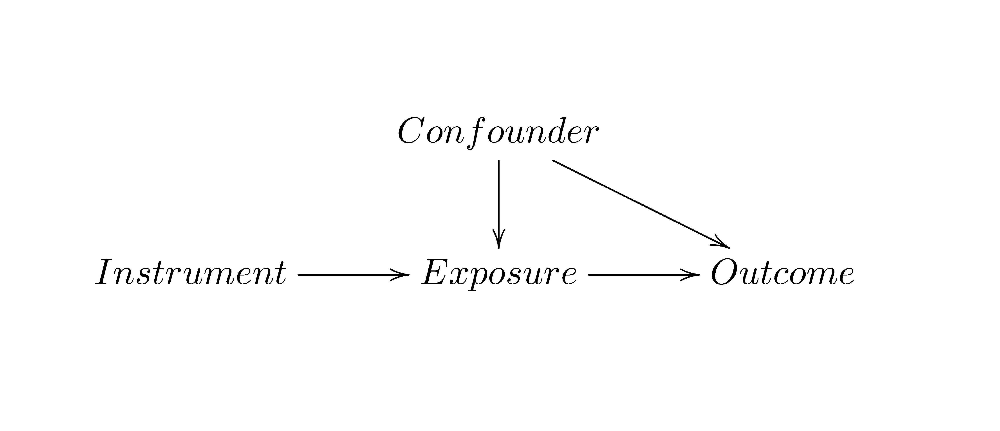

Recently, I found that XY-pic package can draw complex diagrams in LATEX. It allows users to design the diagram and draw as in a matrix. So a diagram is sliced implicitly as a matrix, where each entry is an element of this matrix. It becomes easy to draw a diagram based on positions. 

I saw a flower pattern on the tissues that I use everyday. So I drew this flower:

{width=60%}

### Basics

Basics of XY-pic package are useful. Start the diagram with `\xymatrix{}`. The content is matrix-like. Here is an example of a 2x3 matrix:

```{r eval=FALSE}
\xymatrix{
a & b & e \\
  & c & d
}
```

which gives a diagram like this:

{width=60%}

How to typeset an arrow? Use `\ar[udlr]`. The arrow starts from the current entry in the matrix, and `[udlr]` indicates relative movement from the current entry, where `[u]` means up one level, `[d]` means down one level, `[l]` means left one level, `[r]` means right one level. Repeated movement from `[udlr]` means more than one steps. Just count the steps in the matrix. The example:

```{r eval=FALSE}
\xymatrix{
a & b & e \\
  & c \ar[ur] & d \ar[ull]
}
```

{width=60%}

Arrows have different styles. One simple style is to change the line, such as change the solid line to the dotted or dashed line. The style is specified using `@{}` after `\ar`.

```{r eval=FALSE}
\xymatrix{
a & b & e \\
  & c \ar@{=>}[ur] & d \ar@{.>}[ull]
}
```

{width=60%}

Labels can be added on the arrows, after $^$ or $_$, which are relatively over or below the arrows.

```{r eval=FALSE}
\xymatrix{
a & b & e \\
  & c \ar@{=>}[ur]^a & d \ar@{.>}[ull]_b
}
```

{width=60%}

How about using a curved arrow?

```{r eval=FALSE}
\xymatrix{
a & b & e\\
  & c \ar@/^/@{=>}[ur]^a & d \ar@/^/@{.>}[ull]_b
}
```

{width=60%}

Discussed here are just some of the basic usages. More adjustments are available for the arrow, label and entry. Also, there are more advanced use and applications of XY-pic package. Feel free to read the user's guide. 
I want to mention one practical application, that is, to draw a causal diagram, like this:

```{r eval=FALSE}
\xymatrix{
  & Confounder \ar[d] \ar[dr]& \\
Instrument \ar[r] & Exposure  \ar[r] & Outcome
}
```

{width=80%}

### Reference

Kristoffer H. Rose. 2013. [XY-pic User's Guide](https://mirror.las.iastate.edu/tex-archive/macros/generic/diagrams/xypic/doc/xyguide.pdf)

